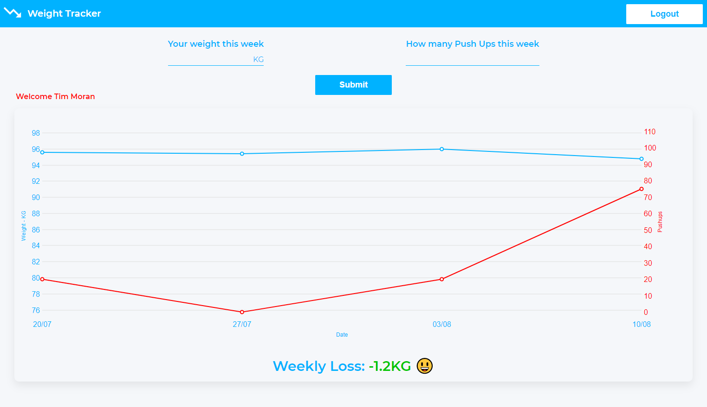

<h1 align="center">Weight Tracker React App</h1>

<p align="center">
<a align="center" href="https://react-weight-tracker.netlify.app" target="_blank">Live Demo - https://react-weight-tracker.netlify.app</a>
  </p>

<p align="center">A React App using Nivo Line Graphs to track weekly weight loss or gains and pushups.</p>



### Installation

```bash
git clone https://github.com/tmoran18/weight-tracker.git
cd weight-tracker
npm i
```

### Firebase Database
- You will need to create your own firebase account and create a real time database 
[Firebase Realtime Database Guide](https://firebase.google.com/docs/database/web/start)
- Once you have created your database you will get config details. Enter these into the config in the firebase.js file
